# Sprint 2

## Formularios

Por favor elegir 2 formularios por persona

1. Login (wireframe ya hecho)
   1. Inicio de sesión

2. Formulario de Registro:
   1. Registro de pequeños empresarios
   2. Registro de clientes

3. Formulario de Recuperación de Contraseña:
   1. Solicitud de recuperación de contraseña
   2. Cambio de contraseña

4. Formulario de Gestión de Catálogos
   1. Agregar/editar productos
   2. Carga de imágenes de productos
   3. Detalles del producto (precio, descripción, inventario)

5. Formulario de Creación de Proyectos
   1. Detalles del proyecto (nombre, descripción)
   2. Objetivo de financiación
   3. Fecha límite

6. Formulario de Reporte de Incidentes:
   1. Descripción del problema
   2. Adjuntar pruebas (imágenes, documentos)

7. Formulario de Pago y Facturación:
   1. Datos de la tarjeta de crédito o cuenta de PayPal

8. Formulario de Administración:
   1. Alta/baja de usuarios
   2. Modificación de permisos
   3. Generación de reportes

9. Formulario de Calificación y Comentarios:
   1. Valoración del producto/servicio
   2. Comentarios adicionales

10. Formulario de Creación de Perfil:
    1. Datos personales del empresario
    2. Información del negocio
    3. Selección de categorías de productos

## Backlog

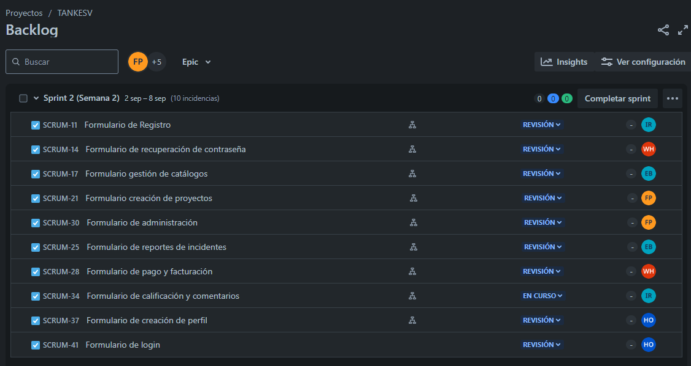

## Tablero SCRUM

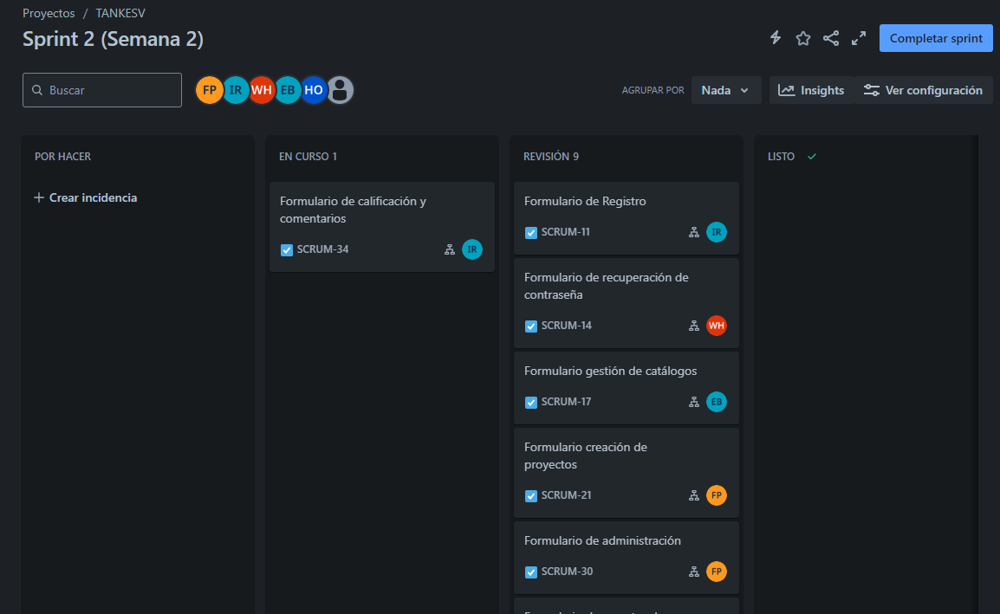

## Capturas

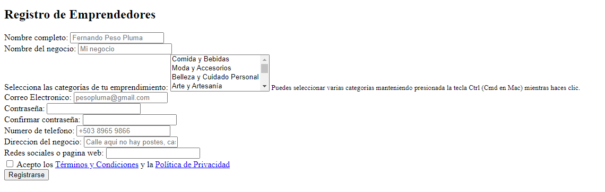
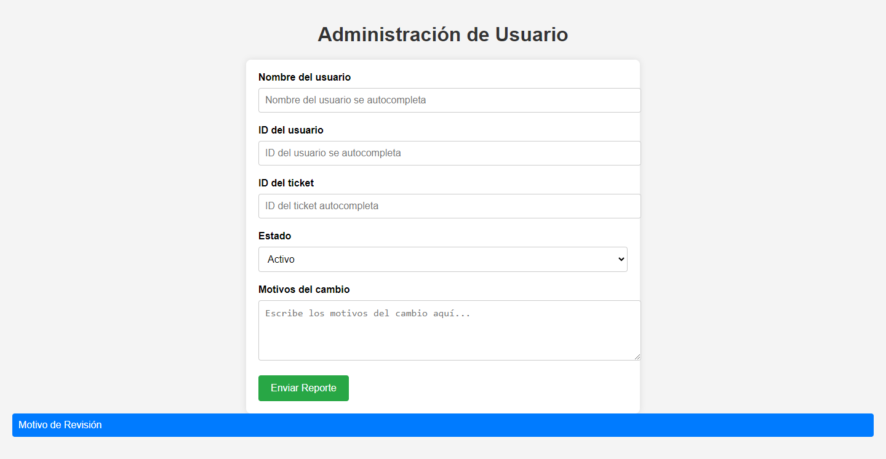
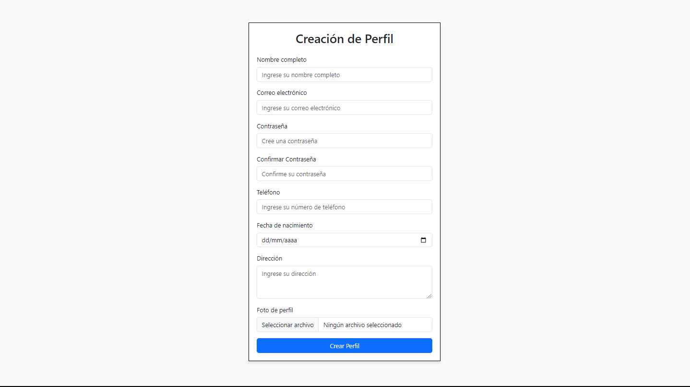
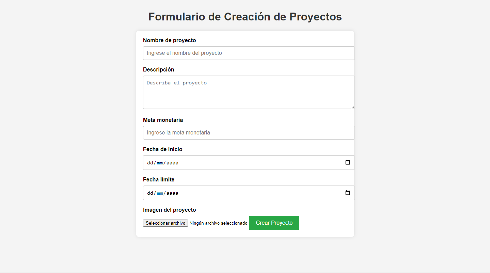
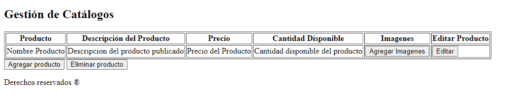
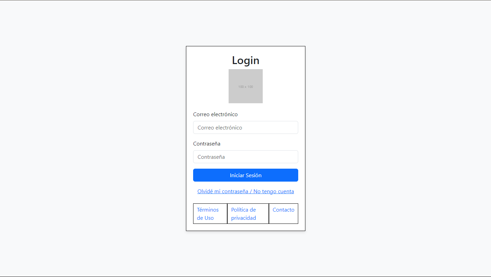
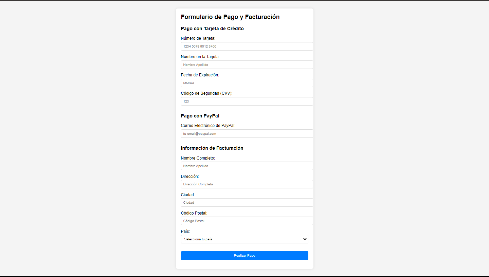
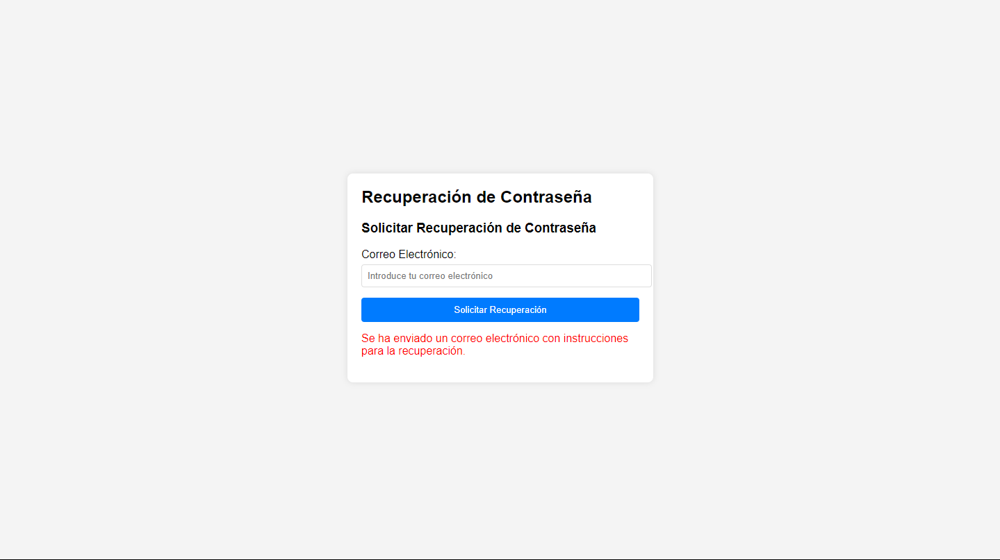
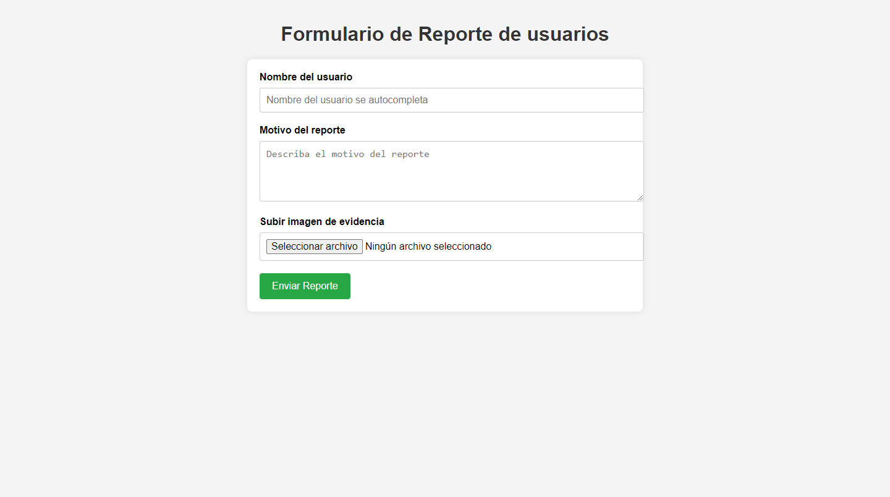
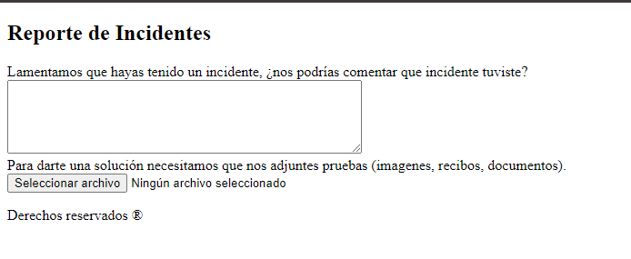
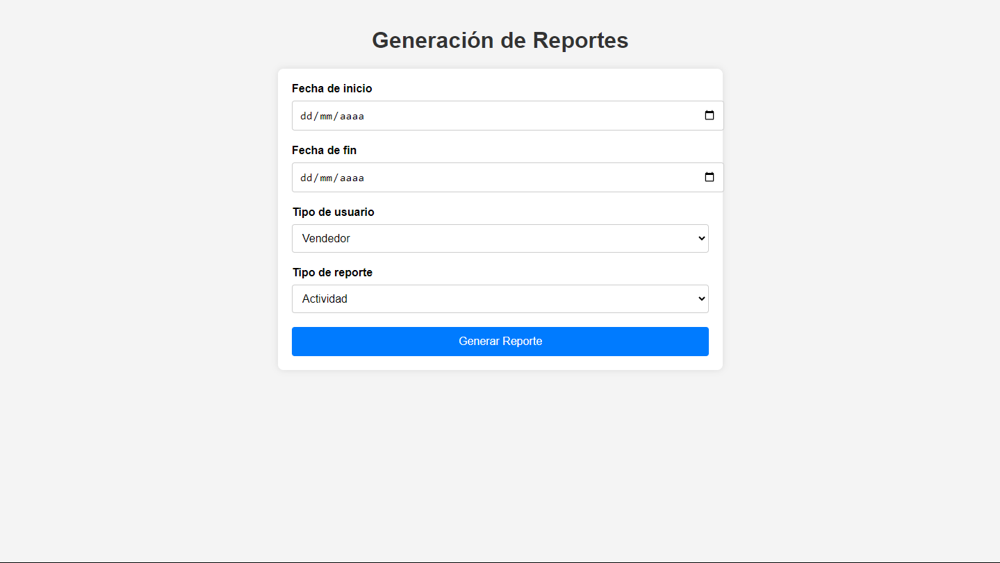
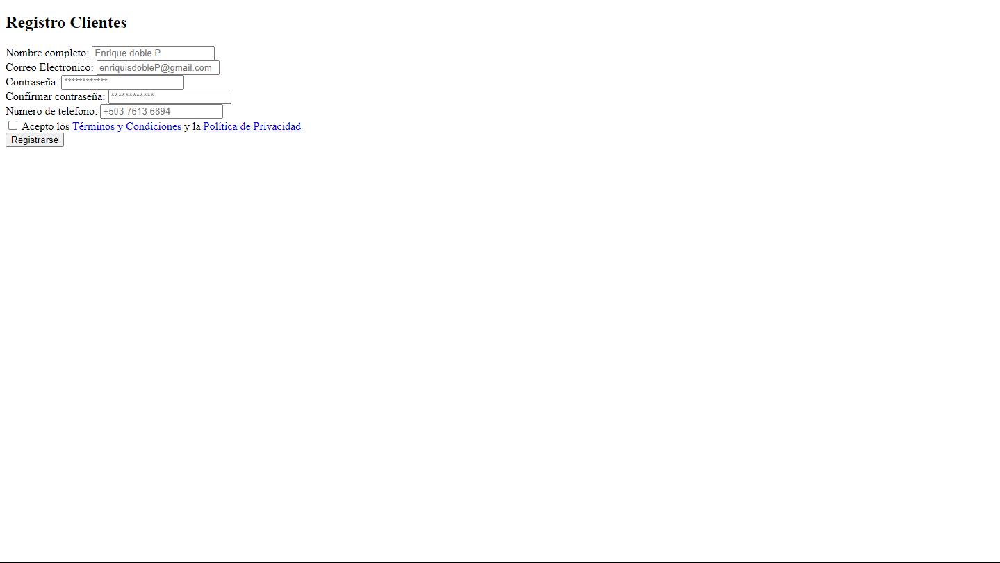

## Elementos de fornt

#0e3af6
Nue Machina
IBM Plex Mono
